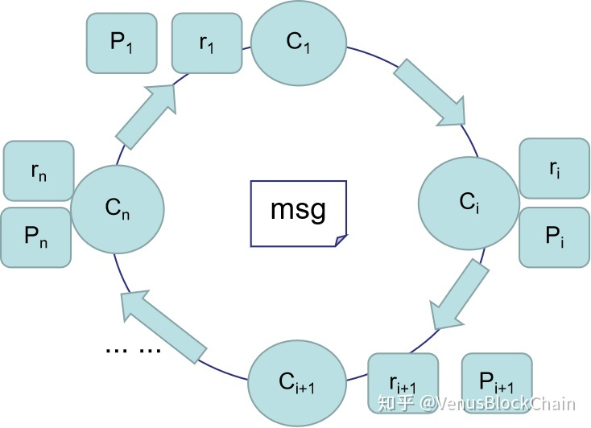

# SAG(Spontaneous Anonymous Group)

环签名基于一个上图的一个构成环的数学理论：
$$c_x=Hash(m,r_{x-1}*G+c_{x-1}*P_{x-1})$$

## 1 签名生成
1) 签名者生成密钥对 $(x_i,p_i),P_i=x_i*G$ 。发布公钥，所有签名者的公钥组成集合 $PK=[P_1,P_2,...,P_n]$
2) 签名者生成n个随机数r，对应n个公钥。签名者本身公钥对应的随机数在之后的计算中得到，n个随机数组成集合 $R=[r_1,r_2,...,r_n]$ ，这里除了自己的 $r_i$ (后面要计算的)，其他公钥的r随机生成。
3）先定义一个式子，假设存在某个随机数k和一个标量 $c_i$，满足 $k*G=r_i*G+c_i*P_i$ ，这里的 $r_i$ 是签名者自身要得到的随机数，这一步，签名者先随机生成k。定义这个式子是为了带入下面的递推式。
4）根据递推式 $c_x=Hash(m,r_{x-1}*G+c_{x-1}*P_{x-1})$ 去计算每个 $c_i$，假设签名者是第i个，我们从第i+1个开始计算：
$$c_{i+1}=Hash(m,r_i*G+c_i*P_i)=Hash(m,k*G)$$

$$c_{i+2}=Hash(m,r_{i+1}*G+c_{i+1}*P_{i+1})$$
$$...$$
$$c_{n}=Hash(m,r_{n-1}*G+c_{n-1}*P_{n-1})$$
$$c_{1}=Hash(m,r_n*G+c_n*P_n)$$
$$...$$
$$c_{i}=Hash(m,r_{i-1}*G+c_{i-1}*P_{i-1})$$

这样就轮完一轮，最后得到 $c_i$ ,由前面定义的式子 $k*G=r_i*G+c_i*P_i$ ，因为签名者自己的公钥 $P_i=x*G$ ，可以看出 $r_i=k-c_i*x$ ，所以我们可以求出满足环的$r_i$ ,可以看出是签名者的 $x$ 起到关键作用。

**注意：上面的所有步骤，目的是为了求出 $r_i$（签名者自己的r），来完成这个环。**

最后，签名者组装环签名 $sig=({{c_1,R}})$ 和一组公钥$PK$ ,发送给接收方。

## 2 签名验证
接收方接收环签名，从 $c_1$ 开始根据递推式 $c_i=Hash(m,r_{i-1}*G+c_{i-1}*P_{i-1})$ 分别去计算出 $c_2,c_3...,c_n$ ,最后根据 $c_n$ 求出 $c_1'$,然后判断求出的 $c_1'==c_1$ 来验证签名是否成立。
本质上看来，使得签名形成一个环，也可以看成添加了更多的公钥参数进来，将自己的公钥隐藏其中。

SAG目前还不能防止双花。无法做可链接认证

