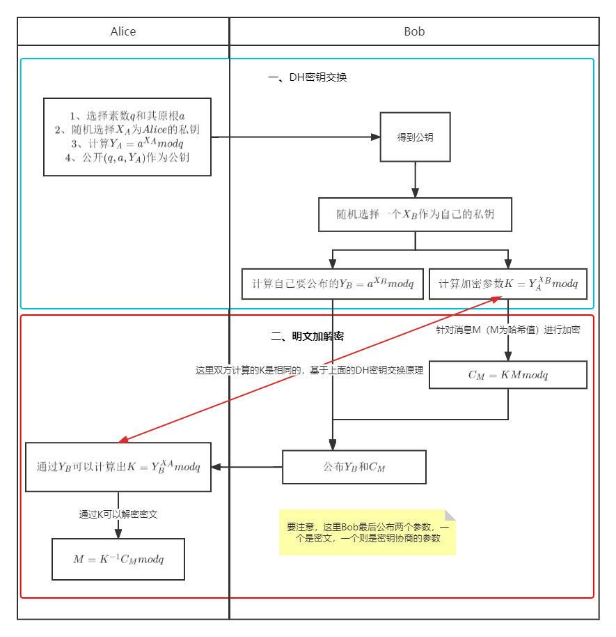

# DH密钥交换&Elgamal公钥加密
Elgamal可以实现公钥加密，其本质其实是对称加密（加密解密用同一个密钥），但是又不需要秘密传输这个密钥。Elgamal公钥加密算法实际上是基于DH密钥交换的，我们先看DH密钥交换算法如何获得同个密钥的。
# 一、Diffie-Hellman密钥交换
首先Diffie-Hellman的有效性是建立在计算离散对数很困难的这一基础上的。它的交换过程如下图所示：

接下来我们看一下它的具体过程：

第一步，Alice和Bob选定一个素数 $q$和它的原根 $a$，并公开。

第二步，用户A和用户B分别选定私钥 $X_A$ 和 $X_B$，并用公布的 $q$ 和 $a$ 分别计算:
 $$Y_A=a^{X_A}mod q ,
 Y_B=a^{X_B}mod q
$$
 $Y_A$ 和 $Y_B$作为A和B的公钥向对方公开。

第三步，A和B通过对方公开的公钥Y分别通过下式计算。

对于A，A拿到B公布的公钥，集合自己的私钥，进行以下计算：
$$K_A=Y_B^{X_A}modq$$

对于B，B拿到A公布的公钥，集合自己的私钥，进行以下计算：
$$K_B=Y_A^{X_B}modq$$
上面两个公式分别求得的$K_A$和$K_B$其实是等价的，也就是协商出来的密钥。以下原理可以证明相同：
$$K_A=Y_B^{X_A}modq=(a^{X_B}modq)^{X_A}modq=a^{X_BX_A}modq$$
$$K_B=Y_A^{X_B}modq=(a^{X_A}modq)^{X_B}modq=a^{X_AX_B}modq$$

我们可以看出 $K_A=K_B=K$， $K$ 也就是Alice和Bob协商出来的密钥

**所以，DH密钥交换的本质是：利用DH技术，只需要公开一些参数，不用密道来传输密钥，就可以得到一个用作对称加密的密钥 $K$。**

# 二、Elgamal的公钥加密方案
## 1 加密方案
EG加密是一种公钥的加密方案，其实是基于上面的DH的“密钥交换”来进行的一种密钥加密方案。

公钥加密方案是用发送方用公钥加密然后接收方用私钥解密。当然在EG中，会用公钥进行一次计算成K后，再用K进行加密。

EG加密算法可以分为密钥交换和明文加解密（对称）两部分，密钥交换就是用DH的方法进行的。而明文加解密则比较简单，因为是一个对称加密的。具体如下图所示：

在EG的公钥加密方案中，可以看到Bob利用Alice公布的公钥组进行一次变化形成K，然后用K消息形成密文 $C_M$，然后计算自己的密钥协商部分 $Y_B$。最后将这两块东西公布后，Alice可以利用自己的私钥计算出K，然后用K解密密文。

**EG公钥加密可以理解成多对一的过程（很多人可以加密，但是只有自己解密），Alice可以和很多人用EG方案进行密钥的协商和加解密。这样Alice可以就可以用自己的一个私钥去和很多方完成这样的加解密过程。**

EG的加密方案有一个优点在于：EG公钥密码是非确定性的，纵使Bob使用其相同的私钥和明文进行加密，每次加密出的结果也不尽相同，原因在于Bob所加密的密钥 $K$以来Alice的私钥和随机参数。

如果用在区块链上的隐私交易场景，那么发送方可以用EG公钥对交易信息进行加密，指定的接收方才能进行解密解开交易信息。可以用该密钥方案来协商密钥进行加密传输。

